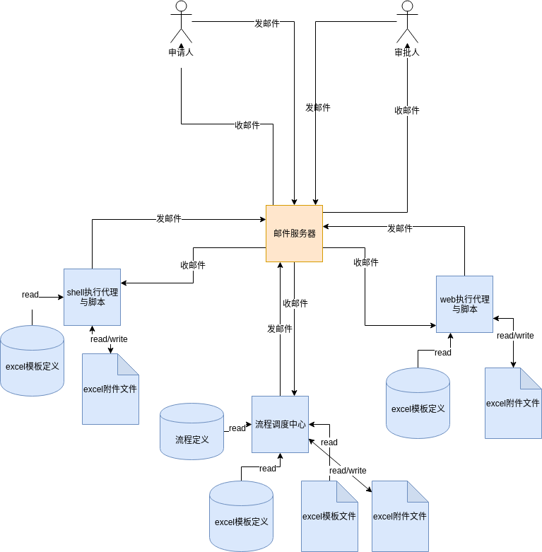
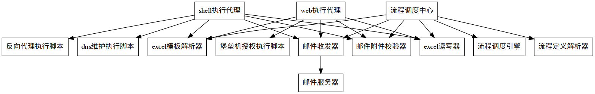

# 设计说明

## 技术架构

## 模块划分

### 流程调度中心
负责根据当前流程定义，决定当前业务工单如何流转，即给哪个邮箱发邮件。它是整个系统的主控模块。它负责启动循环，每隔5分钟收取cloudiip_ops邮箱中的邮件（调用邮件收发器实现），并调用邮件合法性校验器检查附件合法性，然后调用excel模板解析器来获取模板的数据定义，获取工单中的主要业务信息，接着根据获取得工单类型，再调用流程定义解析器获取流程的定义，从而根据流程定义的下一个环节的邮件地址，将调整过的附件发住对应的邮件地址，如此不断重复此过程，实现附件的流转，
模块名：flowControler.py

### 邮件收发器
负责包装邮件收器类，负责邮件的发送与接收。
模块名：emailClient.py

### 邮件合法性校验器
对附件文件名称还内容与模板的对应性进行检查，防止附件不合规导致程序出错。
模块名：attachementVerify.py

### 流程定义解析器
负责解析流程定义json文件
模块名：flowDefineParser.py

### 流程调度引擎
负责根据流程定义信息，来决定下一步即给哪个邮箱发邮件
模块名：flowExecuter.py

### excel模板定义解析器
负责解析excel模板定义json文件，得知关键单元格的行与列及期参数定义等。系统其于它进行对excel的操作。
模块名：excelTempleteParser.py

### excel读写器
负责依据excel模板定义信息，提供简单的接口来实现excel附件的业务数据的读取和写入
模块名: excelReadWriter.py

### 业务执行日志记录器
记录每一个流程环节中执行的事项、执行者、时间、状态等关键信息，用于管理人员对流程进行监控跟踪。
模块名：executeLogger.py

### shell执行代理
负责接收工单邮件，解析exel内容，针对性的执行业务内容调用相应的shell命令或脚本。并将执行结果通过邮件发给系统。
模块名：shellExecuteAgent.py

### web执行代理
负责接上工单邮件，解析excel，针对其中的执行业务内容，调用浏览器，完成一些web系统的操作来完成业务处理。
模块名：webExecuteAgent.py

### 反向代理执行脚本
一个shell脚本，用于完成反向代理的配置，接收参数主要为域名与ip地址列表
脚本名称：revers_proxy.sh
接收参数：动作(action)  被代理url(source)   目标url(target) ，  动作是指add添加，或是del删除， 目标url可以是多个，即可以做负载均衡。

### dns维护执行脚本
一个shell脚本，用于完成dns解析的配置，接收参数为域名和ip
脚本名称： dns.sh
接收参数： 动作(action)，域名(domainName)， ip(ip);       动作是指add或del，即添加解析或删除解析。

### 堡垒机权限管理脚本

由测试脚本录制工具录制修改过的通用的操作堡垒机系统的脚本，它将与执行代理对接完成堡垒机权限的授权的自动化处理。
脚本名称：host_auth.py
接收参数：动作(action)，主机(host)，用户(account)   动作是指是添加(add)权限，还是删除(del)权限，主机即主机ip，用户为在vpn中的账号。

## 接口设计

1. 

## 数据文件设计

### 业务执行日志数据

### 流程定义数工据

### excel模板定义

