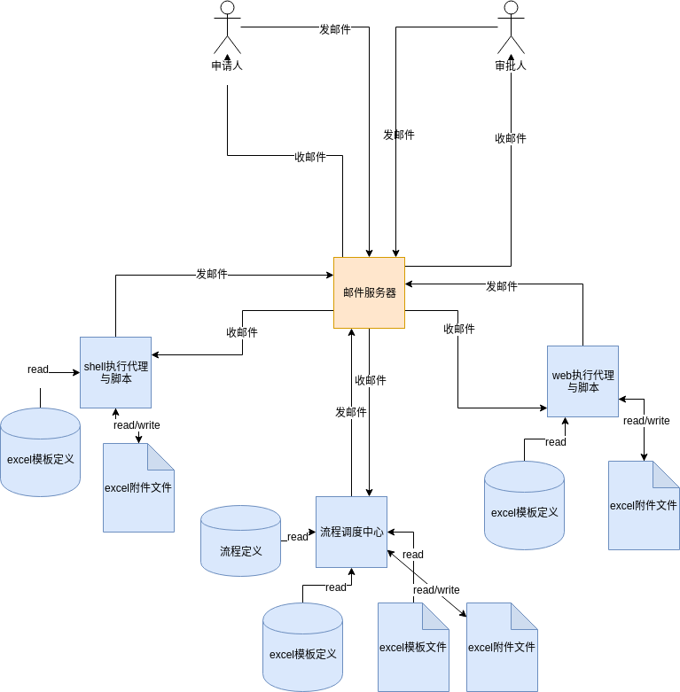
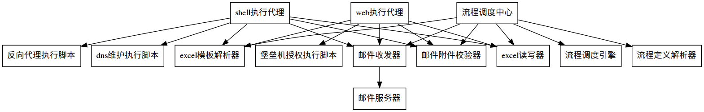

# 设计说明

## 设计原则

1. 采用面向对象设计方法
2. 可扩展性设计：设计稳定的业务流程引擎框架，在业务操作界面（即excel模板）以及流程定义上开放扩展点，方便以后增加新的业务需求。
3. 约定大于配置原则。即尽量减少配置，通过约定来实现各模块之间的协作沟通。


## 技术架构




说明：

1. 邮件协议即承担了分布式组件之间协作的消息沟通机制，也承担了人与软件组件之间的协作的消息沟通机制。
2. 实际上，在流程调度中心内部，也可以扩展业务模块，来对接后台自动任务节点的工作，从而达到特定业务需求。
3. shell/web执行代理与人类一样，属于具体执行节点任务的执行者，所以执行者分为三类：一是远程的执行代理、二是人类、三是系统内部的扩展执行模块。前两者通过邮件沟通，后者为本地调用。
4. 发邮件的动作有两类，一类是系统内部功能，即统一的消息机制，这个逻辑是系统核心的一部分;另一类是扩展模块，即作为一个通知节点存在，这时候这个节点是一个自动任务，它的任务就是发邮件通知。这个通知不需要回复。
5.  由于我们没有采用数据库系统来共享数据，所有系统数据都以json文件形式保存在流程调度中心模块内部，执行代理与流程调度中心模块的相关数据只有通过在excel附件上存储并通过邮件传送来实现共享。


## 模块划分




### 包说明

为了管理方便，将模块分布在多个包中：

- common   代理与主程序共用的模块放这儿，含有邮箱客户端，excel模板解析、系统配置等
- executeAgent   和代理程序有关的模块资源放这儿，含有两个执行代理的模块
- flowControler   主程序的模块放这儿，含用流程调度、流程引擎等。

以下是详细的各模块的说明。


### 流程调度中心

#### 功能职责

​        负责接收各方发来的邮件，根据当前流程定义，决定当前业务工单如何流转，即给哪个邮箱转发邮件。它是整个系统的主控模块。

​	它负责启动循环，每隔5分钟收取cloudiip_ops邮箱中的邮件（调用邮件收发器实现），并调用邮件合法性校验器检查附件合法性，然后调用excel模板解析器来获取模板的数据定义，获取工单中的主要业务信息，接着根据获取得工单类型，再调用流程定义解析器获取流程的定义，从而根据流程定义的下一个环节的邮件地址，将调整过的附件发住对应的邮件地址，如此不断重复此过程，实现附件的流转，

#### 设计说明

| 模块名| 类名| 方法名|备注|
|----|----|----|----|
|flowControler.py|FlowControler|main()| 死循环每隔5分钟执行一次：先调用EmailClient. |
|||| |

### 邮件收发器

#### 功能职责

​    负责包装邮件收器类，负责邮件的发送与接收。

#### 设计说明

| 模块名| 类名| 方法名|备注|
|----|----|----|----|
|emailClient.py|EmailClient| msg[]  getMessages(mailVerify) |得到所有邮箱中的有效的邮件列表，即排除了垃圾邮件，排除是通过 mailVerify来实现，mailVerify可以是None，即不校验不过滤，将会过滤掉不合法的邮件,返回的是邮件列表 |
||| msg getOldestMessage(mailVerify) |得到所有有效邮件中的最早发出的那个，排除是通过 mailVerify来实现，mailVerify可以是None，即不校验不过滤，将会过滤掉不合法的邮件，返回的是邮件对象 |
||| removeMessage(msg) |删除指定的邮件 |
||| getTitleOfMessage(msg) |获取指定邮件的标题 |
||| downloadAttachement(attachement,path) |下载指定的附件文件到指定路径下 |
||| getAttachements(msg) |获取所有附件列表 |
||| getFileNameOfAttachement(attachement) |获取指定附件的文件名称 |

### 邮件合法性校验器

#### 功能职责
​    对邮件标题、附件文件名称还内容与模板的对应性进行检查，防止附件不合法导致程序出错。
#### 设计说明

| 模块名| 类名| 方法名|备注|
|----|----|----|----|
|mailVerify.py|MailVerify|（boolean,message） isAvalible(msg)| 按规则检查邮件是否合法。标题有[bpm]前缀，附件名称前缀存在于法定模板文件名中，附件内容解析后与模板定义中一致。返回值中包含true/false与说明信息。 |
|||| |


### 流程定义解析器

#### 功能职责
负责解析流程定义json文件
#### 设计说明
| 模块名| 类名| 方法名|备注|
|----|----|----|----|
|flowDefineParser.py|FlowDefineParser|parse(filename)| 读取指定的json文件，得到流程定义信息，返回一个字典数据结构; |
|||| |


### 流程调度引擎

#### 功能职责
负责根据流程定义信息，来决定下一步即给哪个邮箱发邮件

#### 设计说明
| 模块名| 类名| 方法名|备注|
|----|----|----|----|
|flowExecuter.py|FlowExecuter|createInstance(filename)| 根据一个excel文件创建流程实例，它是通过调用createInstance(def,params)来创建的。它通过对文件名可解析出流程定义名与实例名，命名规范见“数据文件设计”章节;同时需要通过调用excel读写器取得变量注入到流程实例中，即对createInstance(def,params) 方法中params参数的指定. |
|||loadInstance(filename)| 根据流程实例id加载流程实例，是通过调用 loadInstance(instanceId)来实现。它本身实现解析excel文件名，得到流程实例id。 |
|||createInstance(def,params)| 通过流程定义名称、以及参数字典创建一个流程创建实例。 |
|||loadInstance(instanceId)| 通过一个流程实例的id加载一个流程实例 |
|||getCurrentStep()| 得到当前步骤信息：名称、执行者、时间、返回的是一个字典对象 |
|||getNextStep()| 计算并返回下一步的信息，名称，执行者。这个要用到流程定义信息,返回一个字典对象 |
|||execute(step)| 执行实例的某一步。返回执行状态：true/false,并将执行状态持久化，用于执行同步的自动任务 |
|||complete(step)| 表示该步已完成。 |
|||getFlowVarValue(varName)| 获得流程变量的值。 |
|||setFlowVarValue(varName,value)| 写入流更变量的值。 |
|||getFlowInstanceId()| 得到当前FlowExecuter对象的流程实例id |

### excel模板定义解析器
#### 功能职责

负责解析excel模板定义json文件，得知关键单元格的行与列及期参数定义等。系统其于它进行对excel的操作。

#### 设计说明
| 模块名| 类名| 方法名|备注|
|----|----|----|----|
|excelTempleteParser.py|ExcelTempleteParser|parse(templateName)| 根据模板名称，解析指定路径下的json文件，返回一个字典类型的模板定义信息，模板定义主要是指定了一些业务中需要用到的单元格的位置以及它的变量名称，以及对输入的要求（用于校验） |
### excel读写器
#### 功能职责


负责依据excel模板定义信息，提供简单的接口来实现excel附件的业务数据的读取和写入
#### 设计说明
| 模块名| 类名| 方法名|备注|
|----|----|----|----|
|excelReadWriter.py|ExcelReadWriter|read(varName)| 读取filname指定我excel文件中的某变量值，varName是模板定义中定义的变量名，templateDef是exeTemplateParser类解析出来的模板定义信息。 |
|||__init__(filename)| 指定excel附件文件名实例化对象，这将根据模板名称来加载指定的模板excel以及其定义json文件。 |
|||write(varName,value)| 指定变量与值，将其实入对应的excel中。 |


### shell执行代理

#### 功能职责
负责接收工单邮件，解析exel内容，针对性的执行业务内容调用相应的shell命令或脚本。并将执行结果通过邮件发给系统。
#### 设计说明
| 模块名| 类名| 方法名|备注|
|----|----|----|----|
|shellExecuteAgent.py|ShellExecuteAgent|main()| 调用邮件收发模块，收邮件，校验，得到附件，解析出内容，按内容里的参数，调用对应shell脚本执行，执行完成，更改附件的状态信息，回复邮件到 cloudiip_ops. |


### web执行代理
#### 功能职责
负责接上工单邮件，解析excel，针对其中的执行业务内容，调用浏览器，完成一些web系统的操作来完成业务处理。
#### 设计说明
| 模块名| 类名| 方法名|备注|
|----|----|----|----|
|webExecuteAgent.py|WebExecuteAgent|main()| 调用邮件收发模块，收邮件，校验，得到附件，解析出内容，按内容里的参数，调用对应python脚本执行web动作，执行完成，更改附件的状态信息，回复邮件到 cloudiip_ops. |


### 系统配置
#### 功能职责
负责读取.ini配置文件，目前主要是配置邮箱服务器信息，地址账号
#### 设计说明
| 模块名| 类名| 方法名|备注|
|----|----|----|----|
|config.py||getMainMailInfo()| 得到主程序的邮箱信息 |
|||getAgentMailInfo()| 得到代理程序用的的邮箱信息 |


### 反向代理执行脚本

一个shell脚本，用于完成反向代理的配置，接收参数主要为域名与ip地址列表
脚本名称：revers_proxy.sh
接收参数：动作(action)  被代理url(source)   目标url(target) ，  动作是指add添加，或是del删除， 目标url可以是多个，即可以做负载均衡。

### dns维护执行脚本
一个shell脚本，用于完成dns解析的配置，接收参数为域名和ip
脚本名称： dns.sh
接收参数： 动作(action)，域名(domainName)， ip(ip);       动作是指add或del，即添加解析或删除解析。

### 堡垒机权限管理脚本

由测试脚本录制工具录制修改过的通用的操作堡垒机系统的脚本，它将与执行代理对接完成堡垒机权限的授权的自动化处理。
脚本名称：host_auth.py
接收参数：动作(action)，主机(host)，用户(account)   动作是指是添加(add)权限，还是删除(del)权限，主机即主机ip，用户为在vpn中的账号。


## 接口设计

- 模块间内部接口，在上方各模块、类中已经设计。
- 各软件组件之间采用email协义通信。
- 用户接口，一方面发送消息通过邮件协义，另一方面，业力表单采用excel文档表示，详细的逻辑格式见“数据文件设计”中模板文件设计
- 流程引擎或执行代理与脚本文件之间调用接口采用命令行接口，通过约定的命令行参数实现参数传递。返回值通过标准输出返回。具体的业务接口需要根据实际业务进行设计。


## 数据文件设计

### 命名约定

​    为了简化程序开发，模板定义文件名、附件文件名、流程定义文件名、流程实例数据文件名都用同一个中文字符的前缀，统一叫做业务流程名，一个业务流程对应一个excel模板，excel模板实例与流程实例都是在最后面加一个流水号后缀进行标识。

### 流程定义文件

#### 流程属性

- 流程定义id
- 流程定义名称
- 流程节点列表：多个节点元素组成
- 流程表单：即excel表格
- 流程变量：即流程控制过程中业务需要的变量，有变量名、变量说明以及其它属性
- 流程的路由信息：即表达节点执行的一般顺序以及在某些条件满足后跳转以的节点。主要实现顺序与分支。

#### 节点属性

- id

- name

- 任务类型 ：人工或自动，人工任务节点的逻辑目前比较统一，就是给执行者发邮件，内容就是excel文件;自动任务需要自定义，指定所调用的扩展模块。

- 执行者：姓名或email，注意自动任务不需要指定执行者。因为是系统在执行。

  

#### 示例

文件名：flow_邮箱注册.json

```json

  { 

    "id" : "flow001",
    
    "name" : "邮箱注册",

      "flowVars" : [
          {
              "varName" : "emailAddress",
              "varValue" : ""
          },
          {
              "varName" ："name",
              "varValue" : ""
          },
          {
              "varName" : "result",
              "varValue" : "yes"
          }
      ],

    "nodes" : [

                {

                   "id" : "node1",

                   "name" : "注册审批",
                    
                   "taskType" : "man",
                    "actor" : "songzongquan"

                    "route":[
                        {
                            "toNode" : "node4",
                            "condition" : "result == no "
                        },
                        {
                            "toNode" : "node2",
                            "condition" : "result == yes"
                        }
                    ]

                },

                { 

                    "id" : "node2",

                    "name" : "邮箱验证",
                    
                    "taskType" :"man",
                    "actor"  :  "${申请人}"

                    "route":[
                        {
                            "toNode" : "node3",
                            "condition" : ""
                        }
                    ]

                },

               
                 {

                        "id" : "node3",

                        "name" : "邮箱入库",
                        "taskType" : "auto",//如果是执行代理在执行，即远程执行，那么auto改为remote
                        "script" : "emailsave.py",  //这些脚本可能是本地或远程，它统一用命令行调用方式与主程序交互，可接收参数，可返回参数。都有主程序传送和接收，然后再作后续处理，需要注意的是，如果是执行代理执行这些脚本，返回的参数可能需要按约定的模板格式写入到excel中，作为附件回传到系统，为后续流程处理所使用。

                        "route":[
                        {
                            "toNode" : "node4",
                            "condition" : ""
                        }
                    ]

                 }，
                 {

                        "id" : "node4",

                        "name" : "通知申请人",
                        "taskType" : "auto",
                       
                        "script" : "tongzhi.py",
                                                                

                        "route" : {}

                 }

      ]

  }
```
上例的图形表示如下：


### 流程实例文件

文件名称示例:   flow\__邮箱注册_\_001_.json


### 合法邮箱列表

lagel\_email.xlsx

它的格式如下：

| 邮箱地址 | 姓名 | 手机号 | 部门名称 |
| -------- | ---- | ------ | -------- |
|          |      |        |          |
|          |      |        |          |
|          |      |        |          |

用来保存注册通过的邮箱及拥有人的姓名与手机号等信息，作为以后合法邮件申请的检查与校验来用。

不再这个列表中的邮件过来后，我们是被系统排除在外的。

### excel模板文件

文件名称示例：form\_邮箱注册.xlsx，即前面以form\_开头表示这是业务表单文件。

具体业务不同而内容也不同。

### excel附件实例文件

文件名称示例form\_邮箱注册\_001.xlsx ，001为流水号。即流程实例号。除文件名称外，其内容格式与模板是一致的。


### excel模板定义文件

文件名称示例：form\_邮箱注册.json，表示这是业务表单相关的文件。

```json
{
    "emailAddress":{  //以流程中约定的变量名为key，以在excel中的坐标为属性，目的方便读写表格中的关键值。
        "sheet" :1, //或sheet名
        "row" : 2, //或A:1这要表示方法
        "col" : 5
    },
    
    "name" :{
        "sheet" :1,
       "row" :5,
        "col" :8
          
     }
    
    
}
```


